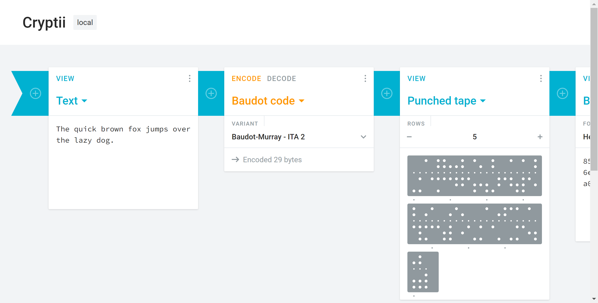

___
# The Easy CryPtography
___
> do more and then classify later
[TOC]
## 1 Character Encoding
### Topic Description
  In the computing industry, standards are established to facilitate information interchanges among American coders. Unfortunately, I've made communication a little bit more difficult. Can you figure this one out? 41 42 43 54 46 7B 34 35 43 31 31 5F 31 35 5F 55 35 33 46 55 4C 7D

### analyse
2023.2.23
就一串数字，有可能是用的16进制,转十进制后翻译成ascll码
试试手算：
    ascll对照表：[https://tool.oschina.net/commons?type=4]

ABCDEF{45C11_15_U53FUL}
省去后CTFlearn{45C11_15_U53FUL}

### improve 
太慢了，有没有快一点的方法？

2023/2/23
The `echo <hex value> | xxd -r -p` command in a terminal can be used to quickly convert hexadecimal values to their ASCII representation.

`echo '41 42 43 54 46 7B 34 35 43 31 31 5F 31 35 5F 55 35 33 46 55 4C 7D' | xxd -r -p
`
but my termial output error,maybe 
2023/2/24
I don't install xss tools

so I find a local tool net help me.
[https://dmgs.dk/cryptii/]

